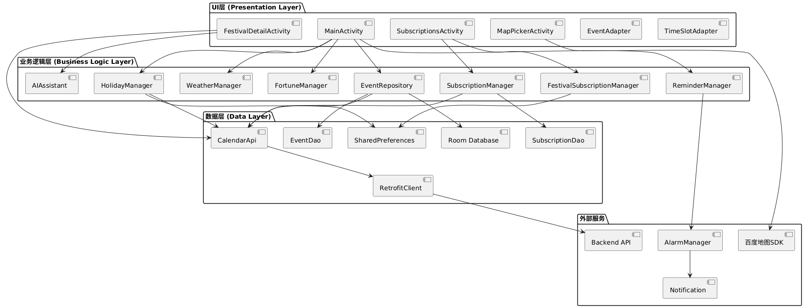
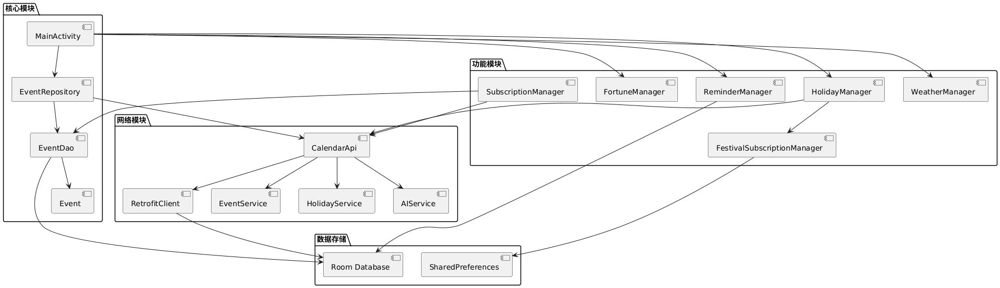
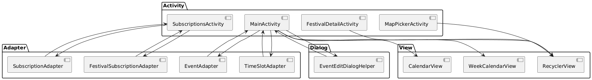
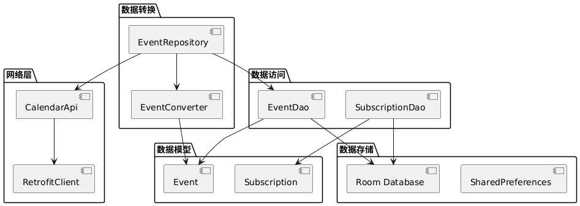
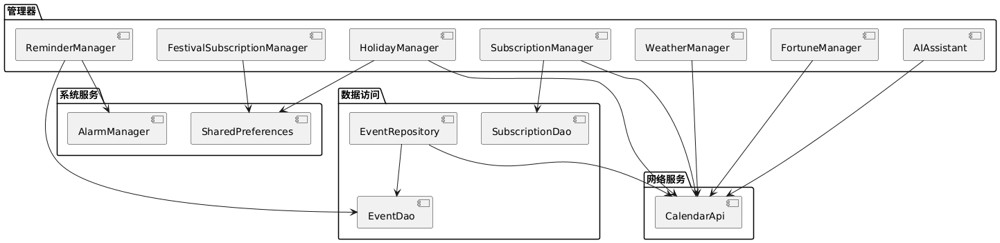
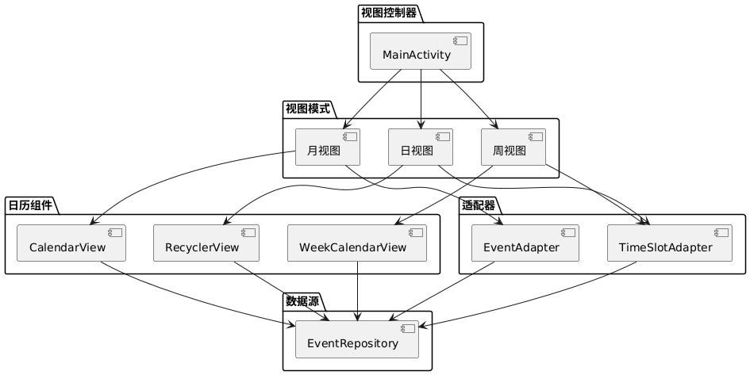

# ③ 软件架构图

## 3.1 系统整体架构图

---

## 3.2 数据流架构图

---

## 3.3 模块依赖关系图

---

## 3.4 UI层架构图

---

## 3.5 数据层架构图

---

## 3.6 业务逻辑层架构图

---

## 3.7 网络层架构图

---

## 3.8 视图模式架构图

---

## 架构说明

### 3.1 系统整体架构
展示了UI层、业务逻辑层、数据层和外部服务之间的关系。

### 3.2 数据流架构
展示了数据在各个层次之间的流动过程。

### 3.3 模块依赖关系
展示了各个模块之间的依赖关系。

### 3.4 UI层架构
展示了UI组件的层次结构。

### 3.5 数据层架构
展示了数据存储和访问的架构。

### 3.6 业务逻辑层架构
展示了业务逻辑管理器的架构。

### 3.7 网络层架构
展示了网络服务的架构。

### 3.8 视图模式架构
展示了三种视图模式的架构。

