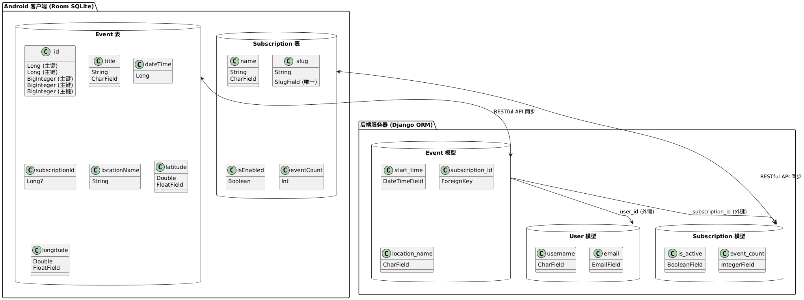
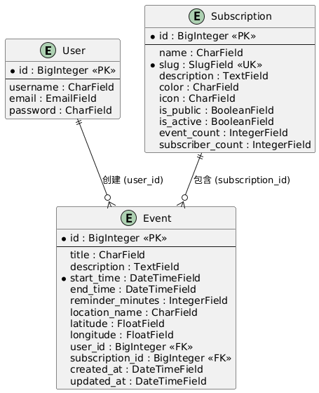
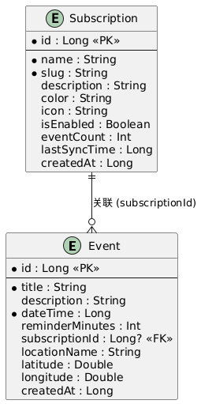
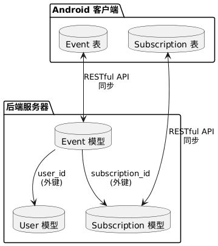
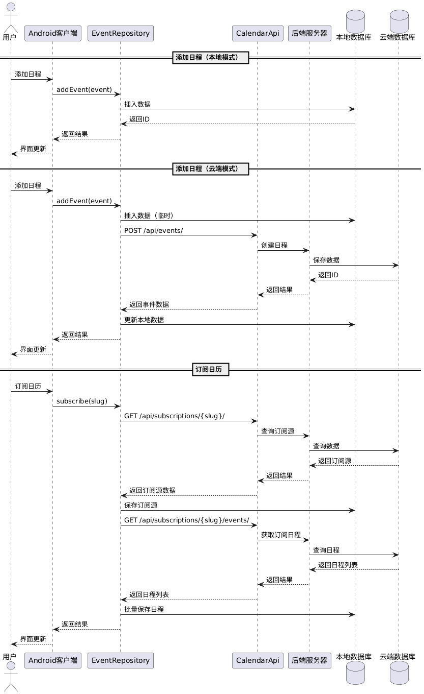
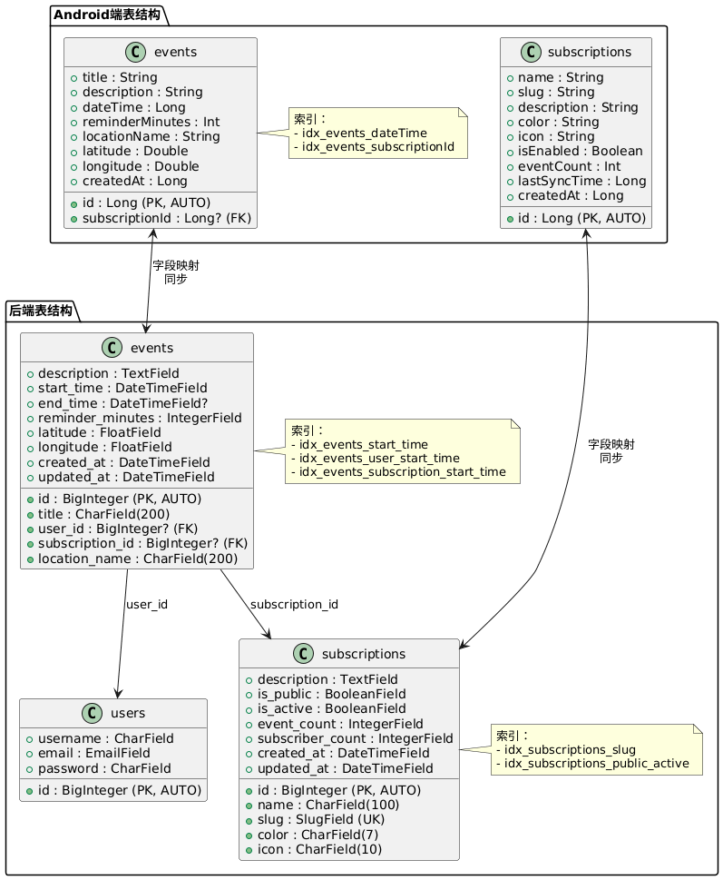

# ⑤ 数据库建模报告

## 📖 目录

1. [概述](#概述)
2. [数据库设计原则](#数据库设计原则)
3. [Android端数据库设计](#android端数据库设计)
4. [后端数据库设计](#后端数据库设计)
5. [数据库关系图](#数据库关系图)
6. [数据同步策略](#数据同步策略)
7. [性能优化](#性能优化)
8. [数据迁移方案](#数据迁移方案)

---

## 1. 概述

Ralendar 采用**前后端分离的数据库架构**：
- **Android端**：使用 Room Database（SQLite）存储本地数据
- **后端**：使用 Django ORM（PostgreSQL/SQLite）存储云端数据
- **数据同步**：通过 RESTful API 实现本地与云端的数据同步

### 数据库架构图



---

## 2. 数据库设计原则

### 2.1 设计理念

- **本地优先**：Android端优先使用本地数据，离线也能正常使用
- **云端同步**：支持云端模式，数据可跨设备同步
- **数据一致性**：通过版本控制和冲突解决机制保证数据一致
- **性能优化**：合理使用索引，优化查询性能

### 2.2 命名规范

- **表名**：小写，复数形式（如 `events`、`subscriptions`）
- **字段名**：驼峰命名（如 `dateTime`、`subscriptionId`）
- **主键**：统一使用 `id`（Long 类型）
- **外键**：使用 `xxxId` 格式（如 `subscriptionId`）

### 2.3 数据类型映射

| Android (Room) | 后端 (Django) | 说明 |
|----------------|---------------|------|
| Long | BigIntegerField | 时间戳、ID |
| String | CharField/TextField | 文本数据 |
| Int | IntegerField | 整数 |
| Double | FloatField | 浮点数 |
| Boolean | BooleanField | 布尔值 |
| 时间戳 (Long) | DateTimeField | 日期时间 |

---

## 3. Android端数据库设计

### 3.1 数据库概述

- **数据库名称**：`calendar_database`
- **数据库版本**：v3
- **ORM框架**：Room Persistence Library
- **存储位置**：`/data/data/com.ncu.kotlincalendar/databases/`

### 3.2 数据表设计

#### 3.2.1 Event 表（日程表）

**表名**：`events`

**用途**：存储用户的所有日程事件，包括用户创建的日程和订阅的日程。

**表结构**：

| 字段名 | 类型 | 约束 | 说明 |
|--------|------|------|------|
| id | Long | PRIMARY KEY, AUTO_INCREMENT | 主键，自增 |
| title | String | NOT NULL | 日程标题 |
| description | String | DEFAULT '' | 日程描述 |
| dateTime | Long | NOT NULL | 日期时间（Unix时间戳，毫秒） |
| reminderMinutes | Int | DEFAULT 0 | 提前提醒分钟数（0=不提醒） |
| subscriptionId | Long | NULLABLE | 关联的订阅ID（null=用户创建的日程） |
| locationName | String | DEFAULT '' | 地点名称 |
| latitude | Double | DEFAULT 0.0 | 纬度（0表示无地点） |
| longitude | Double | DEFAULT 0.0 | 经度（0表示无地点） |
| createdAt | Long | DEFAULT 当前时间戳 | 创建时间戳 |

**索引设计**：

```sql
-- 日期索引：加速日期查询
CREATE INDEX idx_events_dateTime ON events(dateTime);

-- 订阅索引：加速订阅事件查询
CREATE INDEX idx_events_subscriptionId ON events(subscriptionId);
```

**实体类代码**：

```kotlin
@Entity(
    tableName = "events",
    indices = [
        Index(value = ["dateTime"]),
        Index(value = ["subscriptionId"])
    ]
)
data class Event(
    @PrimaryKey(autoGenerate = true)
    val id: Long = 0,
    
    val title: String,
    val description: String = "",
    val dateTime: Long,
    val reminderMinutes: Int = 0,
    val subscriptionId: Long? = null,
    
    val locationName: String = "",
    val latitude: Double = 0.0,
    val longitude: Double = 0.0,
    
    val createdAt: Long = System.currentTimeMillis()
)
```

**字段说明**：

- **id**：主键，自动生成。用于唯一标识每条日程。
- **title**：日程标题，必填。显示在日历上的标题。
- **description**：日程描述，可选。详细说明。
- **dateTime**：日期时间，必填。使用Unix时间戳（毫秒）存储，方便排序和查询。
- **reminderMinutes**：提前提醒分钟数。0表示不提醒，如30表示提前30分钟提醒。
- **subscriptionId**：订阅ID，可空。如果为null，表示这是用户自己创建的日程；如果有值，表示这是从某个订阅源同步来的日程。
- **locationName**：地点名称，如"星巴克(北京路店)"。
- **latitude/longitude**：经纬度坐标，用于地图定位和导航。
- **createdAt**：创建时间戳，用于数据同步和排序。

**数据示例**：

```kotlin
Event(
    id = 1,
    title = "团队会议",
    description = "讨论项目进度",
    dateTime = 1702274400000L,  // 2024-01-10 14:00:00
    reminderMinutes = 30,
    subscriptionId = null,  // 用户创建的日程
    locationName = "会议室A",
    latitude = 28.6776,
    longitude = 115.8974,
    createdAt = 1702270800000L
)

Event(
    id = 2,
    title = "春节",
    description = "中国法定节假日",
    dateTime = 1704067200000L,  // 2024-01-01 00:00:00
    reminderMinutes = 0,
    subscriptionId = 1,  // 来自订阅ID=1的订阅源
    locationName = "",
    latitude = 0.0,
    longitude = 0.0,
    createdAt = 1702270800000L
)
```

#### 3.2.2 Subscription 表（订阅表）

**表名**：`subscriptions`

**用途**：存储用户订阅的日历源信息，如"中国法定节假日"、"世界纪念日"等。

**表结构**：

| 字段名 | 类型 | 约束 | 说明 |
|--------|------|------|------|
| id | Long | PRIMARY KEY, AUTO_INCREMENT | 主键，自增 |
| name | String | NOT NULL | 订阅名称（显示用） |
| slug | String | NOT NULL | 后端标识（API查询用） |
| description | String | DEFAULT '' | 描述信息 |
| color | String | DEFAULT '#667eea' | 显示颜色（十六进制） |
| icon | String | DEFAULT '📅' | 图标emoji |
| isEnabled | Boolean | DEFAULT true | 是否启用显示 |
| eventCount | Int | DEFAULT 0 | 事件数量（统计用） |
| lastSyncTime | Long | DEFAULT 0 | 最后同步时间戳 |
| createdAt | Long | DEFAULT 当前时间戳 | 创建时间戳 |

**实体类代码**：

```kotlin
@Entity(tableName = "subscriptions")
data class Subscription(
    @PrimaryKey(autoGenerate = true)
    val id: Long = 0,
    
    val name: String,              // "中国法定节假日"
    val slug: String,              // "china-holidays"
    val description: String = "",
    val color: String = "#667eea",
    val icon: String = "📅",
    val isEnabled: Boolean = true,
    val eventCount: Int = 0,
    val lastSyncTime: Long = 0,
    val createdAt: Long = System.currentTimeMillis()
)
```

**字段说明**：

- **id**：主键，自动生成。
- **name**：订阅名称，用于界面显示，如"中国法定节假日"。
- **slug**：后端标识，用于API查询，如"china-holidays"。这个值对应后端的订阅源slug。
- **description**：订阅描述信息，简要说明这个订阅包含什么内容。
- **color**：显示颜色，用于在日历上区分不同的订阅源。
- **icon**：图标emoji，用于界面显示。
- **isEnabled**：是否启用显示。用户可以临时禁用某个订阅，但不会删除订阅关系。
- **eventCount**：事件数量，统计这个订阅源有多少个日程事件。
- **lastSyncTime**：最后同步时间戳，用于判断是否需要重新同步。
- **createdAt**：创建时间戳。

**数据示例**：

```kotlin
Subscription(
    id = 1,
    name = "中国法定节假日",
    slug = "china-holidays",
    description = "包含元旦、春节、清明节、劳动节、端午节、中秋节、国庆节等",
    color = "#FF6B6B",
    icon = "🎉",
    isEnabled = true,
    eventCount = 11,  // 2024年有11个法定节假日
    lastSyncTime = 1702270800000L,
    createdAt = 1702270800000L
)

Subscription(
    id = 2,
    name = "世界纪念日",
    slug = "world-days",
    description = "国际节日和纪念日",
    color = "#4ECDC4",
    icon = "🌍",
    isEnabled = true,
    eventCount = 365,  // 每天都有纪念日
    lastSyncTime = 1702270800000L,
    createdAt = 1702270800000L
)
```

### 3.3 DAO（数据访问对象）设计

#### 3.3.1 EventDao

**接口定义**：

```kotlin
@Dao
interface EventDao {
    // 查询所有日程
    @Query("SELECT * FROM events ORDER BY dateTime ASC")
    suspend fun getAllEvents(): List<Event>
    
    // 查询指定日期的所有日程
    @Query("""
        SELECT * FROM events 
        WHERE date(dateTime / 1000, 'unixepoch') = date(:date / 1000, 'unixepoch') 
        ORDER BY dateTime ASC
    """)
    suspend fun getEventsForDate(date: Long): List<Event>
    
    // 查询用户创建的日程（subscriptionId为null）
    @Query("SELECT * FROM events WHERE subscriptionId IS NULL ORDER BY dateTime ASC")
    suspend fun getUserEvents(): List<Event>
    
    // 查询指定订阅的日程
    @Query("SELECT * FROM events WHERE subscriptionId = :subscriptionId ORDER BY dateTime ASC")
    suspend fun getEventsBySubscription(subscriptionId: Long): List<Event>
    
    // 插入日程
    @Insert
    suspend fun insert(event: Event): Long
    
    // 更新日程
    @Update
    suspend fun update(event: Event)
    
    // 删除日程
    @Delete
    suspend fun delete(event: Event)
    
    // 根据订阅ID删除所有关联的日程
    @Query("DELETE FROM events WHERE subscriptionId = :subscriptionId")
    suspend fun deleteBySubscriptionId(subscriptionId: Long)
}
```

**查询方法说明**：

- **getAllEvents()**：获取所有日程，按时间升序排列。
- **getEventsForDate()**：获取指定日期的所有日程。使用日期比较，忽略时间部分。
- **getUserEvents()**：获取用户自己创建的日程（不包括订阅的日程）。
- **getEventsBySubscription()**：获取某个订阅源的所有日程。
- **insert()**：插入新日程，返回插入后的主键ID。
- **update()**：更新日程信息。
- **delete()**：删除日程。
- **deleteBySubscriptionId()**：删除某个订阅源的所有日程（取消订阅时使用）。

#### 3.3.2 SubscriptionDao

**接口定义**：

```kotlin
@Dao
interface SubscriptionDao {
    // 查询所有订阅
    @Query("SELECT * FROM subscriptions ORDER BY createdAt ASC")
    suspend fun getAllSubscriptions(): List<Subscription>
    
    // 查询启用的订阅
    @Query("SELECT * FROM subscriptions WHERE isEnabled = 1 ORDER BY createdAt ASC")
    suspend fun getEnabledSubscriptions(): List<Subscription>
    
    // 根据slug查询订阅
    @Query("SELECT * FROM subscriptions WHERE slug = :slug LIMIT 1")
    suspend fun getSubscriptionBySlug(slug: String): Subscription?
    
    // 根据ID查询订阅
    @Query("SELECT * FROM subscriptions WHERE id = :id LIMIT 1")
    suspend fun getSubscriptionById(id: Long): Subscription?
    
    // 插入订阅
    @Insert
    suspend fun insert(subscription: Subscription): Long
    
    // 更新订阅
    @Update
    suspend fun update(subscription: Subscription)
    
    // 删除订阅
    @Delete
    suspend fun delete(subscription: Subscription)
}
```

### 3.4 数据库实例管理

**AppDatabase 类**：

```kotlin
@Database(
    entities = [Event::class, Subscription::class], 
    version = 3, 
    exportSchema = false
)
abstract class AppDatabase : RoomDatabase() {
    
    abstract fun eventDao(): EventDao
    abstract fun subscriptionDao(): SubscriptionDao
    
    companion object {
        @Volatile
        private var INSTANCE: AppDatabase? = null
        
        fun getDatabase(context: Context): AppDatabase {
            return INSTANCE ?: synchronized(this) {
                val instance = Room.databaseBuilder(
                    context.applicationContext,
                    AppDatabase::class.java,
                    "calendar_database"
                )
                    .fallbackToDestructiveMigration()  // 开发阶段允许破坏性迁移
                    .build()
                INSTANCE = instance
                instance
            }
        }
    }
}
```

**数据库版本历史**：

- **v1**：初始版本，包含基础的Event和Subscription表。
- **v2**：添加地图导航字段（locationName, latitude, longitude）。
- **v3**：添加索引优化查询性能（dateTime, subscriptionId）。

---

## 4. 后端数据库设计

### 4.1 数据库概述

- **ORM框架**：Django ORM
- **数据库**：PostgreSQL（生产环境）/ SQLite（开发环境）
- **迁移管理**：Django Migrations

### 4.2 核心数据模型

#### 4.2.1 Event 模型（日程模型）

**模型定义**：

```python
from django.db import models
from django.contrib.auth.models import User

class Event(models.Model):
    """
    日程事件模型
    
    存储用户的所有日程，包括用户创建的日程和订阅的日程。
    """
    # 基本信息
    id = models.BigAutoField(primary_key=True)
    title = models.CharField(max_length=200, help_text="日程标题")
    description = models.TextField(blank=True, default="", help_text="日程描述")
    
    # 时间信息
    start_time = models.DateTimeField(help_text="开始时间")
    end_time = models.DateTimeField(null=True, blank=True, help_text="结束时间（可选）")
    reminder_minutes = models.IntegerField(default=0, help_text="提前提醒分钟数（0=不提醒）")
    
    # 关联信息
    user = models.ForeignKey(
        User, 
        on_delete=models.CASCADE, 
        related_name='events',
        null=True, 
        blank=True,
        help_text="创建者（null表示公开订阅的日程）"
    )
    subscription = models.ForeignKey(
        'Subscription',
        on_delete=models.CASCADE,
        related_name='events',
        null=True,
        blank=True,
        help_text="关联的订阅源（null表示用户创建的日程）"
    )
    
    # 地点信息
    location_name = models.CharField(max_length=200, blank=True, default="", help_text="地点名称")
    latitude = models.FloatField(default=0.0, help_text="纬度（0表示无地点）")
    longitude = models.FloatField(default=0.0, help_text="经度（0表示无地点）")
    
    # 元数据
    created_at = models.DateTimeField(auto_now_add=True, help_text="创建时间")
    updated_at = models.DateTimeField(auto_now=True, help_text="更新时间")
    
    class Meta:
        db_table = 'events'
        ordering = ['start_time']
        indexes = [
            models.Index(fields=['start_time']),
            models.Index(fields=['user', 'start_time']),
            models.Index(fields=['subscription', 'start_time']),
        ]
        unique_together = [
            ('subscription', 'start_time', 'title'),  # 同一订阅源同时间同标题的唯一性
        ]
    
    def __str__(self):
        return f"{self.title} - {self.start_time}"
```

**字段说明**：

- **id**：主键，自动生成。
- **title**：日程标题，必填，最大长度200字符。
- **description**：日程描述，可选。
- **start_time**：开始时间，必填，使用DateTimeField。
- **end_time**：结束时间，可选。
- **reminder_minutes**：提前提醒分钟数，0表示不提醒。
- **user**：创建者，可空。如果为null，表示这是公开订阅的日程；如果有值，表示这是用户创建的日程。
- **subscription**：关联的订阅源，可空。如果为null，表示这是用户创建的日程；如果有值，表示这是从订阅源同步来的日程。
- **location_name**：地点名称。
- **latitude/longitude**：经纬度坐标。
- **created_at/updated_at**：创建和更新时间，自动管理。

**索引设计**：

- **start_time索引**：加速日期查询。
- **user + start_time联合索引**：加速用户日程查询。
- **subscription + start_time联合索引**：加速订阅日程查询。
- **唯一约束**：同一订阅源、同一时间、同一标题的日程唯一，防止重复同步。

#### 4.2.2 Subscription 模型（订阅模型）

**模型定义**：

```python
class Subscription(models.Model):
    """
    日历订阅模型
    
    代表一个订阅源，如"中国法定节假日"、"世界纪念日"等。
    """
    id = models.BigAutoField(primary_key=True)
    name = models.CharField(max_length=100, help_text="订阅名称")
    slug = models.SlugField(unique=True, help_text="唯一标识（URL友好）")
    description = models.TextField(blank=True, default="", help_text="描述信息")
    
    # 显示设置
    color = models.CharField(max_length=7, default="#667eea", help_text="显示颜色（十六进制）")
    icon = models.CharField(max_length=10, default="📅", help_text="图标emoji")
    
    # 订阅设置
    is_public = models.BooleanField(default=True, help_text="是否公开订阅")
    is_active = models.BooleanField(default=True, help_text="是否激活（管理员可以禁用）")
    
    # 统计信息
    event_count = models.IntegerField(default=0, help_text="事件数量")
    subscriber_count = models.IntegerField(default=0, help_text="订阅者数量")
    
    # 元数据
    created_at = models.DateTimeField(auto_now_add=True, help_text="创建时间")
    updated_at = models.DateTimeField(auto_now=True, help_text="更新时间")
    
    class Meta:
        db_table = 'subscriptions'
        ordering = ['name']
        indexes = [
            models.Index(fields=['slug']),
            models.Index(fields=['is_public', 'is_active']),
        ]
    
    def __str__(self):
        return self.name
```

**字段说明**：

- **id**：主键，自动生成。
- **name**：订阅名称，如"中国法定节假日"。
- **slug**：唯一标识，URL友好，如"china-holidays"。用于API查询。
- **description**：描述信息。
- **color**：显示颜色，用于界面区分。
- **icon**：图标emoji。
- **is_public**：是否公开订阅。公开订阅任何人都可以订阅。
- **is_active**：是否激活。管理员可以禁用某些订阅源。
- **event_count**：事件数量，统计这个订阅源有多少个日程。
- **subscriber_count**：订阅者数量，统计有多少用户订阅了这个源。
- **created_at/updated_at**：创建和更新时间。

### 4.3 数据关系

#### 4.3.1 Event 与 Subscription 的关系

```
Subscription (1) ──────── (N) Event
      │                         │
      │                         │
订阅源：中国法定节假日           多个日程：元旦、春节、清明节...
```

**关系说明**：

- 一个订阅源可以有多个日程事件（一对多关系）。
- 一个日程事件只能属于一个订阅源（多对一关系）。
- 使用外键 `subscription` 关联。

#### 4.3.2 Event 与 User 的关系

```
User (1) ──────── (N) Event
  │                   │
  │                   │
用户：张三             多个日程：会议、约会、提醒...
```

**关系说明**：

- 一个用户可以创建多个日程事件（一对多关系）。
- 一个日程事件只能属于一个用户（多对一关系）。
- 使用外键 `user` 关联。

---

## 5. 数据库关系图

### 5.1 后端ER图（实体关系图）



### 5.2 Android端ER图



### 5.3 数据流关系图



### 5.4 数据同步流程图



### 5.5 数据库表结构对比图



---

## 6. 数据同步策略

### 6.1 同步机制

**本地优先策略**：

1. **读取数据**：优先从本地数据库读取，保证快速响应。
2. **后台同步**：在后台异步同步云端数据，更新本地数据库。
3. **冲突解决**：以云端数据为准，本地数据会被覆盖。

**同步流程**：

```
用户操作 → 本地数据库 → Repository → API → 云端数据库
   ↓                                         ↓
界面更新                                 同步响应
```

### 6.2 同步场景

#### 场景一：添加日程

**本地模式**：
```
用户添加 → 本地数据库 → 界面更新
```

**云端模式**：
```
用户添加 → 本地数据库 → API请求 → 云端数据库
           ↓                              ↓
       界面更新                      同步成功响应
```

#### 场景二：订阅日历

```
用户订阅 → API请求 → 获取订阅源信息 → 保存到本地Subscription表
         ↓
    获取订阅日程 → API请求 → 批量获取日程 → 保存到本地Event表
```

#### 场景三：数据同步

```
应用启动 → 检查最后同步时间 → 调用API同步 → 更新本地数据
```

### 6.3 数据转换

**Android端与后端的字段映射**：

| Android字段 | 后端字段 | 转换说明 |
|-------------|----------|----------|
| dateTime (Long) | start_time (DateTime) | 时间戳 ↔ 日期时间字符串 |
| subscriptionId | subscription_id | ID直接映射 |
| id | id | 主键直接映射 |

**转换代码示例**：

```kotlin
// Android端：Event → 后端EventRequest
fun Event.toEventRequest(): EventRequest {
    return EventRequest(
        title = this.title,
        description = this.description,
        start_time = Date(this.dateTime).toISOString(),
        reminder_minutes = this.reminderMinutes,
        location_name = this.locationName,
        latitude = this.latitude,
        longitude = this.longitude
    )
}

// 后端EventResponse → Android端Event
fun EventResponse.toEvent(): Event {
    return Event(
        id = this.id,
        title = this.title,
        description = this.description,
        dateTime = Date.parse(this.start_time).time,
        reminderMinutes = this.reminder_minutes,
        subscriptionId = this.subscription_id,
        locationName = this.location_name ?: "",
        latitude = this.latitude ?: 0.0,
        longitude = this.longitude ?: 0.0
    )
}
```

---

## 7. 性能优化

### 7.1 索引优化

**Android端索引**：

- **Event.dateTime索引**：加速日期查询，用于获取某一天的日程。
- **Event.subscriptionId索引**：加速订阅日程查询，用于获取某个订阅源的所有日程。

**后端索引**：

- **Event.start_time索引**：加速日期范围查询。
- **Event.user + start_time联合索引**：加速用户日程查询。
- **Event.subscription + start_time联合索引**：加速订阅日程查询。

### 7.2 查询优化

**分页查询**：

```kotlin
// Android端：分页查询日程
@Query("SELECT * FROM events ORDER BY dateTime ASC LIMIT :limit OFFSET :offset")
suspend fun getEventsPaged(limit: Int, offset: Int): List<Event>
```

**批量操作**：

```kotlin
// Android端：批量插入日程（订阅同步时使用）
@Insert
suspend fun insertAll(events: List<Event>)
```

### 7.3 数据缓存

**内存缓存**：

```kotlin
// 缓存当前月份的日程数据
private var cachedEvents: Map<Long, List<Event>> = emptyMap()

fun getEventsForDate(date: Long): List<Event> {
    // 先检查缓存
    if (cachedEvents.containsKey(date)) {
        return cachedEvents[date]!!
    }
    
    // 缓存未命中，查询数据库
    val events = eventDao.getEventsForDate(date)
    cachedEvents = cachedEvents + (date to events)
    return events
}
```

---

## 8. 数据迁移方案

### 8.1 数据库版本升级

**Room Migration**：

```kotlin
val MIGRATION_1_2 = object : Migration(1, 2) {
    override fun migrate(database: SupportSQLiteDatabase) {
        database.execSQL("ALTER TABLE events ADD COLUMN locationName TEXT NOT NULL DEFAULT ''")
        database.execSQL("ALTER TABLE events ADD COLUMN latitude REAL NOT NULL DEFAULT 0.0")
        database.execSQL("ALTER TABLE events ADD COLUMN longitude REAL NOT NULL DEFAULT 0.0")
    }
}

val MIGRATION_2_3 = object : Migration(2, 3) {
    override fun migrate(database: SupportSQLiteDatabase) {
        database.execSQL("CREATE INDEX idx_events_dateTime ON events(dateTime)")
        database.execSQL("CREATE INDEX idx_events_subscriptionId ON events(subscriptionId)")
    }
}

@Database(
    entities = [Event::class, Subscription::class], 
    version = 3, 
    exportSchema = false
)
abstract class AppDatabase : RoomDatabase() {
    // ...
    
    companion object {
        fun getDatabase(context: Context): AppDatabase {
            return Room.databaseBuilder(
                context.applicationContext,
                AppDatabase::class.java,
                "calendar_database"
            )
                .addMigrations(MIGRATION_1_2, MIGRATION_2_3)
                .build()
        }
    }
}
```

### 8.2 数据迁移策略

**开发阶段**：

- 使用 `fallbackToDestructiveMigration()`，允许破坏性迁移（清空数据库重建）。

**生产阶段**：

- 使用 `addMigrations()`，逐步迁移，保留用户数据。
- 测试迁移脚本，确保数据不丢失。

---

## 9. 总结

### 9.1 数据库设计特点

- ✅ **本地优先**：Android端优先使用本地数据，离线也能正常使用。
- ✅ **云端同步**：支持云端模式，数据可跨设备同步。
- ✅ **结构清晰**：表结构简单明了，易于维护和扩展。
- ✅ **性能优化**：合理使用索引，优化查询性能。
- ✅ **数据一致性**：通过版本控制和同步机制保证数据一致。

### 9.2 未来优化方向

- 🔄 **增量同步**：只同步变更的数据，减少网络传输。
- 🔄 **冲突解决**：实现更智能的冲突解决机制。
- 🔄 **数据压缩**：对大量历史数据进行压缩存储。
- 🔄 **备份恢复**：实现自动备份和恢复功能。

---

**文档版本**：v1.0  
**最后更新**：2025年11月  
**维护者**：Ralendar 核心团队

